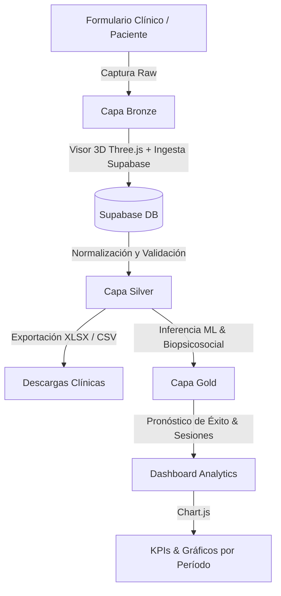

# 🏥 KineData Analytics - Sistema de Fisioterapia & Predicción Clínica con IA

Sistema integral de gestión clínica, análisis biomecánico y predicción de resultados terapéuticos para centros de medicina física y rehabilitación. Integra una arquitectura de datos moderna basada en el **Patrón Medallion (Bronze, Silver, Gold)**, visualización 3D interactiva, integración en la nube mediante **Supabase** y modelos de **Machine Learning** para pronosticar la evolución del paciente y el número de sesiones requeridas.

---

## 📋 Tabla de Contenidos
1. [Descripción General](#-descripción-general)
2. [Arquitectura del Sistema](#-arquitectura-del-sistema)
   - [Arquitectura de Datos Medallion](#arquitectura-de-datos-medallion)
   - [Pila Tecnológica](#pila-tecnológica)
3. [Machine Learning e Inteligencia Artificial](#-machine-learning-e-inteligencia-artificial)
   - [Modelo Entrenado](#modelo-entrenado)
   - [Variables Clínicas y Psicosociales (Features)](#variables-clínicas-y-psicosociales-features)
   - [Importancia de Características (Feature Importance)](#importancia-de-características-feature-importance)
4. [Explicación de Códigos Clave](#-explicación-de-códigos-clave)
   - [`panelweb.py` (Orquestador Streamlit)](#panelwebpy-orquestador-streamlit)
   - [`static/app.js` (Lógica de Negocio y Cliente API)](#staticappjs-lógica-de-negocio-y-cliente-api)
   - [Visor Anatómico 3D con Three.js](#visor-anatómico-3d-con-threejs)
   - [Integración con Supabase (BaaS)](#integración-con-supabase-baas)
5. [Estructura del Proyecto](#-estructura-del-proyecto)
6. [Instalación y Puesta en Marcha](#-instalación-y-puesta-en-marcha)

---

## 🎯 Descripción General

**KineData Analytics** resuelve una de las problemáticas más frecuentes en fisioterapia y kinesiología: **la incertidumbre en los tiempos de recuperación y el abandono terapéutico**.

El sistema permite:
- **Consulta para Pacientes:** Acceso rápido mediante DNI para consultar su diagnóstico estimado, zona anatómica comprometida y plan de sesiones proyectado.
- **Panel Administrativo y Clínico:** Acceso con credenciales para fisioterapeutas y administradores médicos.
- **Evaluación Biopsicosocial Integral:** Registro de escalas estandarizadas de dolor (**EVA**), kinesiofobia (**TSK-11**) y catastrofización ante el dolor (**PCS**).
- **Visor Anatómico 3D en Tiempo Real:** Representación visual tridimensional que resalta la zona lesionada según la selección del fisioterapeuta.
- **Exportación de Datos:** Descarga de expedientes clínicos en formatos **Excel nativo (.xlsx)** y **CSV**.
- **Analítica de Gestión:** Métricas y gráficos interactivos de frecuencias y promedios por zona corporal y períodos temporales.

---

## 🏛 Arquitectura del Sistema

### Arquitectura de Datos Medallion

El flujo de procesamiento clínico adopta los principios del diseño *Lakehouse/Medallion*:



1. **Capa Bronze (Ingesta Directa):**
   - Captura de datos brutos del paciente: DNI, datos demográficos, zona corporal y puntajes de las escalas EVA, TSK-11 y PCS.
   - Sincronización inmediata con el visor anatómico 3D y almacenamiento en Supabase.
2. **Capa Silver (Depuración y Staging):**
   - Limpieza, estandarización y estructuración de la información.
   - Tabla interactiva con opción de exportación instantánea en **Excel (.xlsx)** mediante SheetJS y **CSV**.
   - Mecanismo de contingencia (*fallback*) con datos por defecto en caso de cortes de conexión a internet.
3. **Capa Gold (Inferencia y Resultados de Negocio):**
   - Aplicación de algoritmos de inferencia para determinar la probabilidad de éxito terapéutico y la cantidad óptima de sesiones.
4. **HTML Dashboard Analytics:**
   - Visualización analítica mediante **Chart.js** con filtros dinámicos (Día, Semana, Mes, Año y Selección por Calendario).

### Pila Tecnológica

| Componente | Tecnología | Propósito |
| :--- | :--- | :--- |
| **Backend Host** | Python 3.10+ / Streamlit | Servidor de despliegue, configuración de página y contenedor de la app |
| **Frontend UI** | HTML5, CSS3 Glassmorphism, Vanilla JS | Interfaz responsiva de alto rendimiento médico |
| **Gráficos 3D** | Three.js (WebGL) | Render anatómico interactivo con respuesta dinámica a eventos |
| **Gráficos Analíticos** | Chart.js | Visualizaciones de barras y dona con cálculo dinámico |
| **Base de Datos** | Supabase (PostgreSQL REST API) | Persistencia en tiempo real de registros clínicos |
| **Exportación** | SheetJS (xlsx.full.min.js) | Generación en cliente de hojas de cálculo de Microsoft Excel |
| **Machine Learning** | Scikit-Learn (`RandomForestClassifier`), Joblib, Pandas | Algoritmo predictivo entrenado sobre variables biomecánicas |

---

## 🤖 Machine Learning e Inteligencia Artificial

### Modelo Entrenado

El archivo `modelo_fisioterapia.pkl` contiene un clasificador ensamble **Random Forest (`RandomForestClassifier`)** entrenado mediante **Scikit-Learn** con semilla reproducible (`random_state=42`).

- **Objetivo del Modelo:** Clasificar el pronóstico de recuperación terapéutica (éxito/respuesta favorable del tratamiento) y asistir en la estimación de sesiones requeridas.
- **Enfoque Clínico:** Combina parámetros puramente físicos (rango articular, dolor) con factores **psicosociales** (miedo al movimiento y catastrofismo), fundamentales para evitar la cronicidad del dolor músculo-esquelético.

### Variables Clínicas y Psicosociales (Features)

El modelo toma en consideración 28 dimensiones clínicas:

```python
[
    'edad', 'imc', 'dolor_inicial_eva', 'comorbilidades_num', 'rom_inicial_pct',
    'fuerza_inicial_daniels', 'kinesiofobia_tsk', 'catastrofismo_pcs',
    'indice_vulnerabilidad_psicosocial', 'asistencia_sesiones_pct',
    'num_sesiones_totales', 'genero_Masculino', 'ocupacion_demanda_Moderada',
    'ocupacion_demanda_Pesada', 'ocupacion_demanda_Sedentaria',
    'tipo_lesion_Muscular', 'tipo_lesion_Neurologica',
    'tipo_lesion_Postquirurgica', 'tipo_lesion_Tendinosa', 'cronicidad_Cronico',
    'cronicidad_Subagudo', 'cirugias_previas_1',
    'actividad_fisica_previa_Ocasional', 'actividad_fisica_previa_Regular',
    'cumplimiento_ejercicios_casa_2', 'cumplimiento_ejercicios_casa_3',
    'cumplimiento_ejercicios_casa_4', 'cumplimiento_ejercicios_casa_5'
]
```

### Importancia de Características (Feature Importance)

El análisis del árbol de decisión destaca las siguientes variables con mayor peso en el pronóstico clínico:

| Variable | Peso Relativo | Significado Clínico |
| :--- | :---: | :--- |
| **`edad`** | **26.90%** | Factor fisiológico clave en la tasa de regeneración tisular y plasticidad neural |
| **`indice_vulnerabilidad_psicosocial`** | **9.02%** | Nivel de soporte emocional, entorno socioeconómico y carga de estrés |
| **`kinesiofobia_tsk` (TSK-11)** | **8.07%** | Escala de Tampa para la Kinesiofobia; mide el miedo a moverse por temor al dolor |
| **`dolor_inicial_eva`** | **6.64%** | Escala Visual Analógica (1 al 10); intensidad percibida del dolor agudo/crónico |
| **`asistencia_sesiones_pct`** | **6.47%** | Nivel de adherencia y constancia en el plan de rehabilitación |
| **`catastrofismo_pcs`** | **6.15%** | Pain Catastrophizing Scale; tendencia a magnificar el dolor y sentirse indefenso |
| **`rom_inicial_pct`** | **5.45%** | Rango de movimiento articular inicial evaluado con goniometría |
| **`imc`** | **4.97%** | Sobrecarga articular y factores metabólicos sistémicos |

---

## 🔍 Explicación de Códigos Clave

### `panelweb.py` (Orquestador Streamlit)

Este script Python actúa como el contenedor principal de la aplicación. En lugar de limitarse a componentes estándar de Streamlit, utiliza inyección dinámica para ofrecer una experiencia web modular completa y estilizada:

```python
# Carga modular de HTML, CSS y JavaScript para embeber en Streamlit
def load_modular_web():
    html_path = os.path.join(STATIC_DIR, "index.html")
    css_path = os.path.join(STATIC_DIR, "styles.css")
    js_path = os.path.join(STATIC_DIR, "app.js")

    with open(html_path, "r", encoding="utf-8") as f:
        html_content = f.read()
    with open(css_path, "r", encoding="utf-8") as f:
        css_content = f.read()
    with open(js_path, "r", encoding="utf-8") as f:
        js_content = f.read()

    # Reemplazo de links externos por contenido inline para evitar problemas de rutas en el iframe
    full_html = html_content.replace(
        '<link rel="stylesheet" href="styles.css">',
        f'<style>{css_content}</style>'
    ).replace(
        '<script src="app.js"></script>',
        f'<script>{js_content}</script>'
    )
    return full_html
```

### `static/app.js` (Lógica de Negocio y Cliente API)

#### 1. Comunicación Asíncrona con Supabase y AbortController
Para evitar que la interfaz se congele si la red experimenta lentitud, se utiliza un `AbortController` con límite de 3 segundos antes de activar los datos de contingencia:

```javascript
async function cargarPacientesDesdeSupabase() {
    const controller = new AbortController();
    const timeoutId = setTimeout(() => controller.abort(), 3000);

    try {
        const response = await fetch(`${SUPABASE_URL}/rest/v1/pacientes?select=*&order=id.desc`, {
            method: 'GET',
            headers: {
                'apikey': SUPABASE_KEY,
                'Authorization': `Bearer ${SUPABASE_KEY}`,
                'Content-Type': 'application/json'
            },
            signal: controller.signal
        });
        clearTimeout(timeoutId);
        // Procesamiento y renderizado en Capa Silver...
    } catch (err) {
        usarPacientesPorDefecto(); // Respaldo sin interrupciones
    }
}
```

#### 2. Estimación Dinámica de Sesiones
En el frontend se evalúa preliminarmente la necesidad terapéutica combinando la severidad del dolor con el componente psicológico:

$$\text{Sesiones} = \text{round}\left((\text{EVA} \times 1.5) + \frac{\text{TSK}}{5}\right)$$

```javascript
const sesionesCalc = Math.round((evaVal * 1.5) + (tskVal / 5));
```

#### 3. Búsqueda y Validación por DNI
Permite al paciente ingresar su documento de identidad y consultar de inmediato su plan de rehabilitación:

```javascript
async function buscarPacienteDNI() {
    const dniInput = document.getElementById('dni-consulta').value.trim();
    if (!listaPacientesGlobal || listaPacientesGlobal.length === 0) {
        await cargarPacientesDesdeSupabase();
    }
    const p = listaPacientesGlobal.find(item => String(item.dni).trim() === String(dniInput).trim());
    if (p) {
        // Muestra de resultados (Zona, EVA, Sesiones)
    }
}
```

### Visor Anatómico 3D con Three.js

En `static/app.js`, se inicializa una escena WebGL con cámara en perspectiva y un cilindro anatómico con efecto wireframe. Al cambiar la zona en el formulario (`Hombro`, `Lumbar`, `Rodilla`, `Cervical`, `Tobillo`), el material adapta su coloración en tiempo real:

```javascript
function actualizarZona3D(val) {
    if (currentMesh && currentMaterial) {
        if (val === "Hombro") currentMaterial.color.setHex(0x38bdf8);      // Celeste cyan
        else if (val === "Lumbar") currentMaterial.color.setHex(0xc084fc);  // Púrpura
        else if (val === "Rodilla") currentMaterial.color.setHex(0x34d399); // Verde esmeralda
        else if (val === "Cervical") currentMaterial.color.setHex(0xf59e0b);// Ámbar
        else if (val === "Tobillo") currentMaterial.color.setHex(0xec4899); // Rosa
    }
}
```

---

## 📁 Estructura del Proyecto

```text
sistema-fisioterapia-prediccion/
├── .gitignore                    # Reglas de exclusión de Git (entornos, logs, temporales)
├── README.md                     # Documentación técnica integral del sistema
├── requirements.txt              # Dependencias Python del proyecto
├── panelweb.py                   # Aplicación principal de Streamlit
├── modelo_fisioterapia.pkl       # Modelo de Machine Learning (RandomForestClassifier)
├── fisio.png                     # Recursos gráficos / banner
└── static/
    ├── index.html                # Estructura de vistas (Paciente, Admin, Bronze, Silver, Gold, Analytics)
    ├── styles.css                # Sistema de diseño Glassmorphism, paleta HSL y modo oscuro
    └── app.js                    # Lógica interactiva, Three.js, Chart.js, SheetJS y Supabase REST
```

---

## 🚀 Instalación y Puesta en Marcha

### Prerrequisitos
- **Python 3.10** o superior instalado en el sistema.
- Navegador web moderno con soporte para WebGL (Chrome, Edge, Firefox, Brave).

### Paso 1: Clonar el repositorio y acceder
```bash
git clone https://github.com/mezaj5089-maker/sistema-fisioterapia-prediccion.git
cd sistema-fisioterapia-prediccion
```

### Paso 2: Crear y activar un entorno virtual
En Windows (PowerShell):
```powershell
python -m venv .venv
.\.venv\Scripts\Activate.ps1
```

En Linux / macOS:
```bash
python3 -m venv .venv
source .venv/bin/activate
```

### Paso 3: Instalar las dependencias
```bash
pip install -r requirements.txt
```

### Paso 4: Ejecutar la aplicación
```bash
streamlit run panelweb.py
```

La aplicación se iniciará automáticamente en:
`http://localhost:8501`

---

## 🔐 Credenciales de Acceso al Modo Fisioterapeuta

Para ingresar al panel clínico desde el modo **Admin/Fisio**:
- **Usuario:** `admin` o `fisio`
- **Contraseña:** `fisio2026` o `admin`